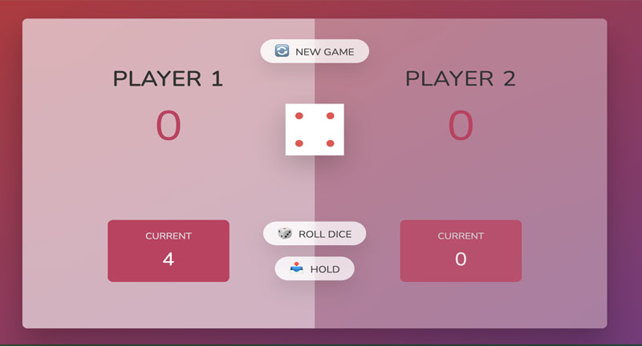

# js-game-roll-dice
A vanilla JavaScript game where 2 players roll dice to see who can get to 100 points first. If a player rolls 1, they loose their current points.

## How Its Done
DOM manipulation techniques like querySelector, addEventListener, textContent, classList.add or remove. Also this game demonstrates how to set up an init function and call it to set the initial state of variables for the game. Also there is a image that displays how the logic for the game is organized before coding to help break the coding up into simpler steps.

